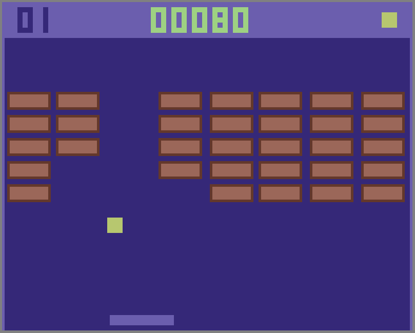

## Breakout game in ThingML

This repo contains the implementation of a simple breakout game in ThingML. This example demonstrate how platform independent components can be created in ThingML and run on very different platforms. The main main game is implemented in `BreakoutGame.thingml`. The sub-directories `_arduino`, `_browser`, `_java`, `_posix` contain the platform specific components which provide the APIs needed by the game to interface with the platform.

## Running on different platforms

### Posix C / SDL 2

The posix version uses the SDL2 library and SDL2_TTF to draw text.

Install the required libraries with:

`sudo apt-get install libsdl2-dev libsdl2-ttf-dev`

### Arduino / Adafruit ST7735

For the arduino target, we are using this shield: https://www.adafruit.com/products/802

This requires the installation of the corresponding libraries in the arduino IDE. The 2 libraries to install are:

* https://github.com/adafruit/Adafruit-ST7735-Library 
* https://github.com/adafruit/Adafruit-GFX-Library 

More details on how to connect and install the libraries can be found here: https://learn.adafruit.com/adafruit-shield-compatibility/1-dot-8-tft-shield-w-slash-joystick

Make sure your hardware and Arduino IDE is working before trying to compile the ThingML generated code.

The control using the buttons is not implemented. It is left as a exercise for you to do.

### JS / Web Browser

Any proper web browser should be fine (Firefox, Chrome, etc). On smartphone, touch interactions are not yet properly managed.

### Java / Swing

Should work on any JVM able to display graphics (non-headless). Maven (and a proper JDK) are needed to compile.
